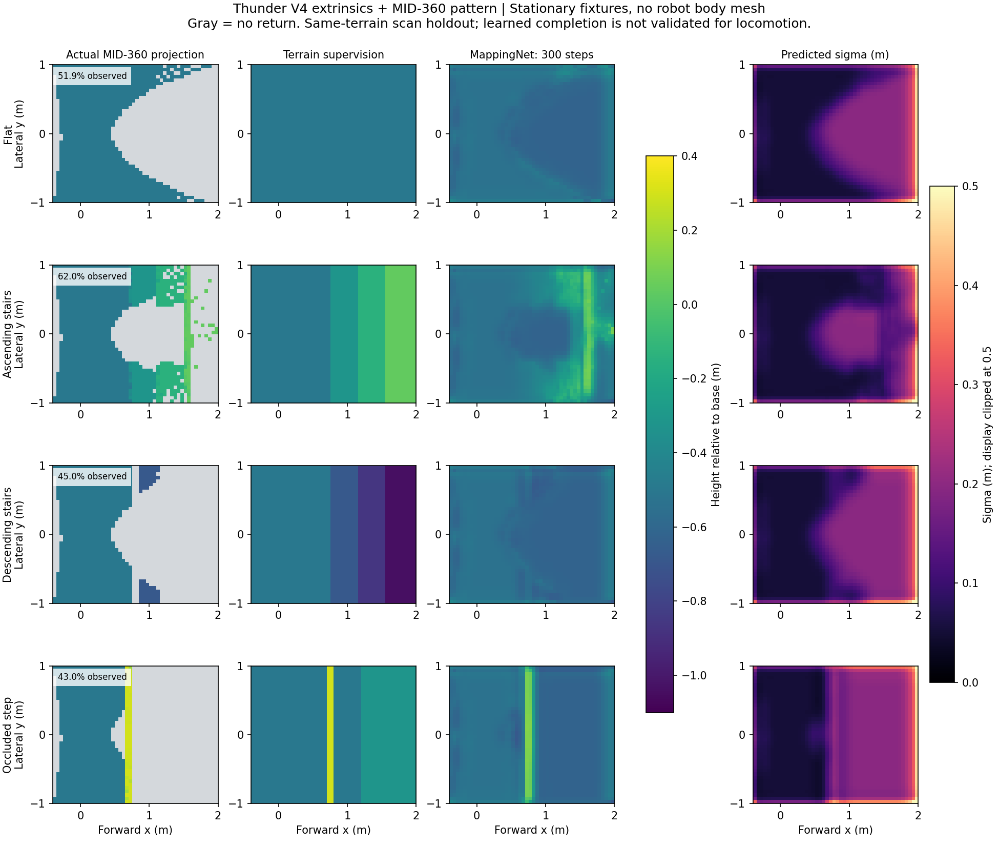

# Thunder V4：从 MID-360 点云到 AME-2 地图输入

2026-09-22。已完成输入模块、几何/历史测试和 GPU 7 的 Isaac Lab 夹具实验。尚未接入 Thunder V4 整机 PPO，当前建图权重不能用于行走。此仓库是 AME-2 的非官方复现；以下 LiDAR 路径是新增适配，并非原论文的现成 MID-360 方案。

后续已确认使用前雷达，并完成视场、投影和网络对照实验，修复方差趋零时的数值错误。最新结果见 [原因诊断](mid360_mapping_diagnosis.md)；下文保留首版 300 步实验记录。

后续进展：新增 [Thunder V4 正式训练输入入口](thunder_mid360_training.md)，已完成平地、起伏/台阶任务各 4 环境 × 2 轮 PPO 的接入验证。下文“尚未接入整机”的描述属于首版记录；建图泛化、长期训练和实机验证仍未完成。

## 1. 参考什么，实际改什么

| 参考 | 借鉴内容 | 本次边界 |
| --- | --- | --- |
| [AME-2 v3](https://arxiv.org/html/2601.08485v3#S5.SS1) | 点云同格最大高度、神经建图、按不确定性选择的历史融合；策略地图为 x/y/z/不确定性 | 复用本仓库 MappingNet 和策略编码器；原深度相机数据分布不能当作 MID-360 数据 |
| [elevation_mapping_cupy](https://github.com/leggedrobotics/elevation_mapping_cupy) | GPU 点云入格、地图融合、可见性清理 | 用于方法参考，没有安装 ROS/CuPy，也没有宣称已实现其可见性清理 |
| [ANYbotics/elevation_mapping](https://github.com/ANYbotics/elevation_mapping) | 机器人位姿和测量不确定性参与高程融合 | 作为几何基线参考；本次常量测量方差并非该项目完整误差传播 |
| [FAST-LIO](https://github.com/hku-mars/FAST_LIO#3-directly-run) 与 [Livox driver2](https://github.com/Livox-SDK/livox_ros_driver2) | LiDAR/IMU 时间同步、逐点时间、运动补偿 | 本模块接受逐点变换；实机里程计、同步和位姿插值仍由前端提供 |
| [OmniPerception fork](https://github.com/Kitjesen/OmniPerception) | 时间推进的 MID-360 pattern、Isaac Lab 射线仿真 | 使用已修正的传感器，不使用其点云策略网络 |

本次选择：**保留全部有效回波后投影，不先做固定 1,024 点的 FPS。** 网格本身把变长点云转成固定大小输入。若后续吞吐不够，先测瓶颈，再比较射线预算、扫描频率和地图分辨率；不要把降采样后的空洞误当平地。

## 2. 输入接口与坐标

实现：[ame2/lidar_mapping.py](../ame2/lidar_mapping.py)。本节历史外参快照：[thunder_v4_mid360_legacy.json](../configs/thunder_v4_mid360_legacy.json)。后续[CAD 原点修正与安装对照](mid360_mount_comparison.md)单独记录。

| 张量 | 形状 | 语义 |
| --- | --- | --- |
| `points_sensor` | B × N × 3 | 雷达坐标系 XYZ，米 |
| `valid` / `exclude` | B × N | 有效回波 / 应排除的自身回波或质量异常点 |
| `world_from_sensor` | B × 4 × 4，或 B × N × 4 × 4 | 完整旋转和平移；逐点形式必须匹配采样时间 |
| `poses` | B × 4 | 基座世界 x/y/z/yaw；世界 z 与重力对齐 |
| `scan_time` | B | 每环境扫描采集时间，秒；一次扫描仅融合一次 |
| 原始高度 / observed / count | B × 1 × 40 × 48 | 每格最大 z / 真实回波标记 / 回波数 |
| 策略地图 | B × 4 × 40 × 48 | **x 米、y 米、基座相对高度 z 米、高度方差 m²** |

局部范围 x∈[-0.4,2.0)、y∈[-1,1)，格长 0.05 m。张量 H=40 是左右方向，W=48 是前后方向；坐标位于格心。单环境四通道 float32 地图为 30 KiB，不含点云、网络、历史地图或优化器。

Omni 当前接口输出 `[XYZ / max_distance, valid]`；用 `omni_points_metres()` **恢复一次**米制坐标。实机已经是米制的 XYZ 直接传入，不做这次缩放。Intensity/tag/逐点时间可供前端过滤和补偿使用，不作为当前地图的四个策略通道。

变换采用 `T_world_sensor = T_world_base @ T_base_sensor`，包括基座 roll/pitch；只在最终局部裁剪时去掉 roll/pitch，保留 yaw。实机已经完成去畸变的点云，不可再重复做逐点补偿。

前端须提供自身回波和异常点的排除掩码；当前投影器仅实现有限值、有效标记、排除掩码和范围过滤，尚无自动机器人网格过滤或离群点分类器。**保留地面点。** 同格最大 z 对孤立高点敏感，也不能把悬空物体上表面直接解释为可踩踏面。

## 3. 点云到地图的实际流程

```python
import torch
from ame2.lidar_mapping import GridSpec, LidarElevationMap, omni_points_metres, project_scan

# Create once; mapper is a MappingNet trained on the same grid/sensor contract.
grid = GridSpec()
history = LidarElevationMap(num_envs, grid).to(device)

# Run when a new scan arrives. These tensors must be on the same device.
points_m, valid = omni_points_metres(omni_observation, max_distance)
scan = project_scan(points_m, valid, world_from_sensor, poses, grid, exclude=self_hit_mask)
with torch.no_grad():
    height, log_variance = mapper(scan.height)
history.update(height, log_variance, scan.observed, poses, scan_time)

# At control rate: crop with the current pose; do not re-fuse an old scan.
policy_map, measured_mask, measurement_age = history.crop(current_poses, now)
# Pass policy_map to the AME2 student with proprioceptive history and commands.
# Reset only the environments whose episodes ended:
history.reset(done_env_ids)
```

1. 空格填 -2 m，同时保存 `observed=False`。填充值仅是当前局部高度范围下的网络编码，不能单独作为真假观测依据。MappingNet 沿用单通道输入，需用相同未知值重新训练；不直接使用旧深度预训练权重。
2. MappingNet 输出高度与 **log-variance**；β-NLL 用仿真地形真值监督。策略使用 `exp(log_variance)` 的方差，不直接使用 log-variance 或 sigma。原始观测标记不会被网络改写。
3. 新历史模块按世界坐标存高度，再按当前基座 z/yaw 裁剪；机器人升降、转弯不应把同一个台阶写成不同高度。每环境独立滚动 8 m × 8 m 地图，越界不夹到边缘，不循环绕回。
4. 已有单元使用概率 WTA：有效新方差下限为旧方差的一半，按相对方差选择高度。空单元直接初始化，这是本次适配的工程选择，避免旧未知方差把第一条真实观测抬成很大的方差；不是逐字复现原融合器。
5. 未真实观测的预测设置至少 1 m² 方差；历史以 0.01 m²/s 增大方差，2 s 失效。输出方差目前在 1 m² 饱和。这些都是起始参数，未经 MID-360 实测标定，不能当作校准的概率保证。
6. 重复/乱序扫描不更新地图；网络补全不能刷新真实观测年龄。真实回波出现过并不保证该格保留的 WTA 高度准确，`measured_mask` 仅表示近期覆盖来源。网格碰撞先归约，再更新，避免 GPU 重复索引写入的不确定结果。

融合状态不保留梯度。先单独监督训练建图，再冻结它做学生策略实验。地形真值只用于建图监督、教师或 Critic；不能把特权 height scanner 直接伪装成学生 LiDAR 观测。

## 4. 已完成的逐步验证

本地及服务器 thunder2 环境各 **37 项测试通过**：新输入/回归测试 18 项，现有网络测试 19 项。涵盖米制恢复、未知格、最大高度、范围边界、完整外参、逐点变换、环境隔离、升降与转向、滚动地图、扫描去重、部分 reset、未知来源、过期、坐标通道和前后向梯度。另在 GPU 7 重载已保存的 MappingNet checkpoint 和扫描网格，确认历史模块与学生网络前后向梯度均为有限值。

GPU 7 RTX 3090，Isaac Sim 5.0 / Isaac Lab 2.2.1 / PyTorch 2.7.0+cu128：四个静止夹具，每环境 30 个扫描窗口、每窗口 20,000 条 MID-360 pattern 射线。固定基座高度 0.5 m，10 Hz 扫描，截断距离 10 m。**这不是含机器人身体和运动关节的整机测试。**

| 夹具 | 单帧平均真实覆盖 | 历史融合后近期真实覆盖 |
| --- | ---: | ---: |
| 平地 | 52.3% | 55.4% |
| 上台阶 | 62.2% | 75.9% |
| 下台阶 | 44.7% | 45.9% |
| 遮挡台阶 | 42.9% | 43.5% |

平面真实回波投影的最大高度误差约 0.0000006 m，说明该夹具中坐标和缩放相互一致；这不证明实机外参正确。四环境合计传感器更新加投影中位耗时约 22 ms，不含物理步、网络和完整控制循环。

300 步 MappingNet 训练，验证集仅留出同四个地形的后 30% 扫描窗口：

| 验证量 | 训练前 | 300 步后 |
| --- | ---: | ---: |
| 全图高度 MAE | 38.3 cm | 12.5 cm |
| 有回波区域 MAE | 25.5 cm | 4.5 cm |
| 无回波区域 MAE | 51.3 cm | 20.7 cm |

检查点重载一致；传感器地图经过历史模块进入 AME2 学生编码器后，前向和反向链路可运行。该策略头仍为仓库原有 12 关节配置，**没有适配 Thunder V4 的关节顺序、轮子、动作缩放和电机接口，也没有训练运动策略**。

原始数值见 [result JSON](mid360_validation_20260922.json)。其中 `mapping_training_seconds` 包含训练后的验证和编码器检查，`torch_peak_allocated_mib` 不包含 Warp 和 Isaac Sim 内存。



图中灰色为没有回波。四列依次是最后一帧原始投影、监督真值、网络补全、预测 sigma。最终策略使用方差；右列为了读图显示其平方根，色标上限截为 0.5 m。

**当前不能直接进入行走训练的证据：**最后一帧，前方 x=0.5–2 m、|y|≤0.2 m 的窄条区域，平地和下台阶真实覆盖均为 0；上台阶为 12.5%，遮挡场景为 6.7%。补全的阶沿仍明显不准。不能用网络猜测掩盖这个盲区，94.4% 的像素误差落在预测 2σ 内也不等于不确定性经过标定。

## 5. 外参与接入前必须解决的实际问题

配置快照来自 LingTu `config/robots/doso/thunder_v4/robot.yaml`：位置约 `[0.402876,0,0.058202]` m，RPY=`[-π,-π/4,0]`。它对应现有 MJCF 的前方 `lidar1_link`。同一 MJCF 另有后方 `lidar2_link`，位置约 `[-0.30638,0,0.19417]` m；泛称 `lidar_site` 也在后方，不能与前方外参混用。

本次按前方外参解释雷达扫描坐标；用户已确认使用前雷达。仍需核对 CAD link 到真正扫描坐标轴的关系，再加载完整 Thunder V4 资产验证遮挡。当前前方盲区涉及安装朝向/扫描坐标约定，不能仅凭夹具结果判定实机安装错误。

之后按以下顺序推进，每项不通过先修对应输入：

1. 完整模型上的站立、俯仰、转弯和前进扫描；验证雷达朝向、机身/腿部自遮挡、台阶边缘位置、逐点运动补偿、实机回放一致性。
2. 多地形、多位置、多姿态的 MID-360 数据集，按**地形**划分验证集；随机化遮挡、丢点、量测误差、延迟与位姿误差。评估台阶边缘 MAE、未观测区 MAE、误差/方差分桶和覆盖率；增加不确定性不应成为掩盖高度失败的方法。
3. 先用几何融合和真实观测做可解释基线，再比较学习补全；测 32/128/256 环境吞吐与显存，决定扫描预算。
4. 适配 Thunder 的动作/接触/本体状态契约，用独立的传感器观测接入学生；先跑小规模 rollout、PPO 更新和恢复测试，再安排长训练。

## 6. 代码修正与复现

旧 `WTAMapFusion.crop()` 曾输出 `[height,nx,ny,variance]`，与 teacher/symmetry 的 xyz 语义不符。现已统一为 xyz+variance，修复局部图按真实范围采样、地图扰动保持 x/y、部分 reset 的高级索引副本问题及空 reset。旧法向量通道训练出来的 student checkpoint 不能按新通道直接使用。

旧 manager-based 深度 wrapper 仍从 `teacher_privileged` 构造输入，且只提供 4 个足端接触量，而当前 Critic 需要 13 个 link 接触量；旧历史路径也未采用新 LiDAR 模块的完整位姿/时间逻辑。**当前 Thunder LiDAR 实验使用独立验证脚本，不应直接运行旧 wrapper 并宣称已接上雷达。** 三处原有 Critic 单元测试的 4 维 fixture 已改成网络实际要求的 13 维，并不表示上述环境接触接口已适配。

使用现有环境，无新增安装：

```bash
PYTHONPATH=. OMP_NUM_THREADS=2 python -m pytest scripts/test_lidar_mapping.py scripts/test_ame2.py -q

# Run from this checkout, in the existing thunder2 environment.
# Set OMNI_ROOT to the parent directory containing the fixed LidarSensor package.
export OMNI_ROOT=/home/bsrl/omni-test-codex/LidarSensor
export PYTHONPATH="$PWD:$OMNI_ROOT"
CUDA_VISIBLE_DEVICES=7 timeout --kill-after=10s 180s python scripts/validate_mid360_isaaclab.py --headless --device cuda:0 --config configs/thunder_v4_mid360_legacy.json
python scripts/plot_mid360_validation.py
```

结果写入 `artifacts/mid360_validation/`：数值 JSON、原始网格 NPZ、实验 checkpoint。示例服务器代码在 `/home/bsrl/ame2-mid360-codex`；checkpoint 仅供复现实验。

本次所有实验断言与结果保存完成后，Isaac Sim 卡在 `app.close()`；已终止本次测试进程，确认 GPU 7 释放。上面的外部 timeout 限制退出挂起时间；**timeout 的非零退出不能改称正常退出**，需结合日志区分断言失败与关闭阶段挂起。这一运行环境问题尚未修复。
