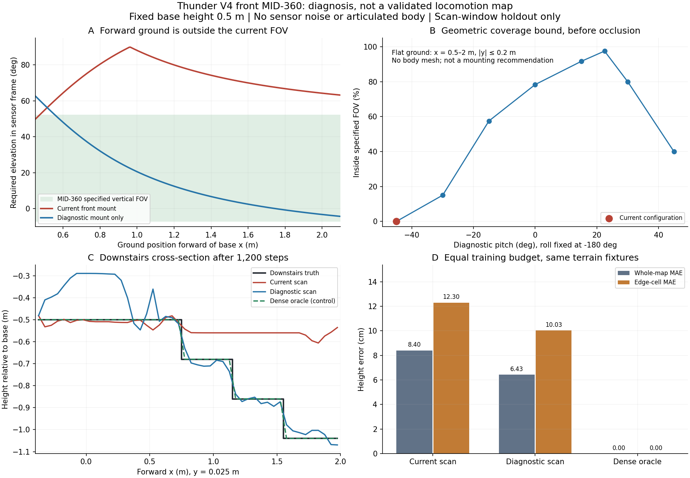

# 前 MID-360 地图补全不准：原因与对照实验

2026-09-22。用户已确认使用 Thunder V4 **前雷达**，对应 `lidar1_link`。当前结论：输入链路可以运行，但还不能可靠复原无回波区域；延长训练并不能消除所有台阶歧义。

## 首版到底做了什么

首版先把 OmniPerception 的归一化 XYZ 恢复成米，通过完整外参/位姿变换到重力对齐坐标；保留有效回波，投到 5 cm 的格子，同格取最高 z。缺失格子填 -2 m 并保存独立观测标记。浅层 MappingNet 用一个当前扫描高度图预测高度与 log-variance，历史模块再融合预测，按当前位置和 yaw 裁成 `[x,y,z,variance]`。

这不是对完整三维场景的无损重建。一个格子只有一个高度，点云的竖直结构会丢失；网络补全是依赖训练分布的估计。历史融合可以保存曾经看到的地方，但无法凭空制造从未观测过的高度。

## 一、当前朝向存在几何视场盲区

本次 pattern 文件包含 800,000 条角度记录，实测仰角约 -7.21° 至 52.16°；[Livox 官方规格](https://www.livoxtech.com/mid-360/specs)的名义竖直范围是 -7° 至 52°。

沿用当前配置 `RPY=[-180°,-45°,0°]`，基座高度固定 0.5 m，雷达位置约 `[0.4029,0,0.5582]` m。正前方地面目标在**雷达自身坐标系**需要的仰角为：

| 相对基座的地面 x | 需要的雷达仰角 | 在名义视场内？ |
| --- | ---: | --- |
| 0.50 m | 54.9° | 否 |
| 0.75 m | 76.9° | 否 |
| 1.00 m | 88.1° | 否 |
| 1.50 m | 72.0° | 否 |
| 2.00 m | 64.3° | 否 |

在 y=0 截面，用名义 FOV 计算的地面空缺区约为 x=0.47–4.95 m。这个范围针对上述固定姿态/高度，不能推广到运动机器人所有姿态。它解释了为什么前方 0.5–2 m 区域在静止扫描中持续缺失：不是点数暂时太少，而是目标方向在视场之外。

用独立的射线与箱体求交程序重建同四个 Isaac 夹具，整个观测掩码的 IoU 为 98.61%；去掉阶沿相邻格后，两个实现的高度最大差约 0.0000006 m。剩余差异集中在恰落于格边的立面射线，float32 运算可把它分入相邻两格之一。本次明确报告这种差异，不把独立计算说成与 Isaac 每个像素完全一致。

将模拟 pitch 改成 +22.5°、其余参数相同，前方窄条的理想平地 FOV 覆盖上界从 0% 变成 97.5%；实际 pattern 采样覆盖见 [数值结果](mid360_diagnosis_20260922.json)。这是用于定位原因的对照，不是已经验证的安装方案。还需要检查完整机身遮挡、速度下的观测距离和实际安装坐标轴。

当前 `robot.yaml`、MJCF 前雷达 link、robot package 安装四元数一致，但这些都来自同一套模型/配置，**一致不等于实机扫描坐标已被独立标定**。尚无实机点云证明 CAD link 轴与真实 LiDAR 输出轴完全相同；不得仅为得到好看的仿真覆盖率就改写硬件外参。

## 二、网格投影在立面和阶沿处已经有误差

对于上台阶，光线可以先击中台阶立面，尚未击中踏面。同格取最大 z，也不保证这个最大回波就是踏面高度；5 cm 格子还可能跨越高度不连续处。

独立射线对照中，上台阶已观测的边缘格平均高度误差约 **8.0 cm**，远离边缘的已观测平面误差接近浮点精度。说明边缘问题在进入网络前就存在。边缘指标定义为真值高度跳变左右两侧的相邻格；未观测格不计入该原始投影误差。

不能直接靠平滑处理：平滑会进一步削弱阶沿。下一版数据应标明立面/踏面或测量冲突，让未看到踏面的格子保持不确定，并分别评价踏面高度与边缘位置。不能把所有立面回波都简单当作踏面，也不能删除全部地面点。

## 三、现有网络在一部分盲区无法区分不同地形

当前 MappingNet 是浅层局部卷积网络；历史地图在它**之后**融合，当前帧网络本身没有读历史。

在 x≈1.225 m、y≈0.025 m 的测试格，计算得到输出的结构依赖范围为 13×13 格，约 0.65×0.65 m。计算时用平均池化覆盖最大池化所有可能依赖的输入，因此是该输出位置的依赖范围上界。

平地与下台阶在这个范围内给网络的输入完全相同，全部是未知填充值，但真值相差 **36 cm**。1,200 步后网络在两种情况下也给出完全相同的预测。这不是再训练几百步就能解决的问题：同一输入无法唯一确定两个不同目标，在这对样本的该格上，平均绝对误差至少为 18 cm。

更大的空间上下文、真实观测的历史输入和移动扫描可能减少歧义；必须用新数据验证。对于仍不可观测的区域，应保持未知身份和高不确定性，不能声称已经复原。

## 四、300 步训练不足，但更多训练只能解决其中一部分

使用三组对照，网络结构、随机种子、优化器、训练预算相同。每组 40 个扫描窗口；前 28 个用于训练，后 12 个验证。四种地形仍相同，所以这里只判断原因，**不证明新地形泛化**。

| 输入 | 300 步全图 MAE | 1,200 步全图 MAE | 1,200 步未观测区域 MAE | 1,200 步阶沿 MAE |
| --- | ---: | ---: | ---: | ---: |
| 当前前雷达朝向 | 10.24 cm | 8.40 cm | 15.33 cm | 12.30 cm |
| 诊断朝向 +22.5° | 8.70 cm | 6.43 cm | 11.49 cm | 10.03 cm |
| 完整真值网格对照 | <0.01 cm | <0.01 cm | 不适用 | <0.01 cm |

当前朝向在 1,200 步后，有回波区域的网络输出 MAE 约 1.46 cm；这仍不是实机精度，实验没有加入真实传感器噪声。完整真值输入是复制/保真能力对照，不能把接近零的误差解释成从稀疏点云恢复地图的能力。

诊断朝向改善了前方输入，但未观测区域误差仍大；改变一个角度不足以交付可靠地图。当前 40 窗口对照与首版 Isaac 的 30 窗口结果不是同一数据集，不应把两组数值连成同一条训练曲线。



图 A：当前朝向的前方地面需求仰角超出实际 FOV。图 B：不同 pitch 的几何可观测上界，不包括机身和环境遮挡。图 C：下台阶中心剖面，补全仍有明显错误。图 D：相同 1,200 步预算下的全图与阶沿误差。

## 五、本次修复了一个训练数值错误

无噪声完整真值对照在初次运行第 415 次更新前产生非有限损失。300 步时平均 sigma 已降至约 0.00002 m；原实现允许高斯方差继续趋零，β-NLL 的除法与梯度随后失稳。

已在 MappingNet 输出和独立 β-NLL 入口统一设置 **1e-6 m²** 数值方差下限，并加入零残差、极低 log-variance 的回归测试。这仅是数值下限（对应 sigma=1 mm），不代表 MID-360 有 1 mm 精度，也不代表预测不确定性已校准。

修复后，本地和服务器各 **38 项测试通过**；GPU 7 上三组各 1,200 步训练均完成，逐步检查 loss 和梯度为有限值，进程正常退出并释放 GPU。

## 接下来如何提高地图质量

1. **先核对前雷达扫描轴与安装轴。** 使用实机平地/已知阶高点云或已确认的标定，核对回波方向；加载完整 Thunder V4 验证遮挡。优先改善可观测性。
2. **建立测量基线。** 分开保存踏面高度、立面/边缘冲突、观测标记、年龄；比较原始投影和融合后的真实观测，不允许网络补全掩盖输入不足。
3. **给网络足够上下文。** 研究先融合经过位姿对齐的真实观测再补全，或扩大感受野；单独测试这些改动，避免同时改传感器、网络和损失导致原因不清。
4. **换成真正的泛化验证。** 增加阶高/阶宽/台阶位置、运动姿态、遮挡、噪声和定位误差，按地形划分训练/验证集；再用误差与方差的关系检验不确定性。通过后接入小规模 Thunder rollout，而非直接安排长 PPO。

复现当前对照（现有 thunder2 环境，无新增依赖）：

```bash
CUDA_VISIBLE_DEVICES=7 PYTHONPATH=. python scripts/diagnose_mid360_mapping.py \
  --pattern /home/bsrl/omni-test-codex/LidarSensor/LidarSensor/sensor_pattern/sensor_lidar/scan_mode/mid360.npy \
  --device cuda:0 --steps 1200
PYTHONPATH=. python scripts/plot_mid360_diagnosis.py
```

完整数值：[mid360_diagnosis_20260922.json](mid360_diagnosis_20260922.json)。原始扫描/预测数组留在服务器及本地 `artifacts/mid360_diagnosis/maps.npz`。代码与证据更新在 [PR #3](https://github.com/Kitjesen/ame2/pull/3)。
