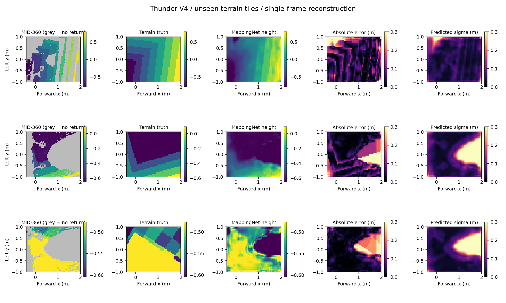
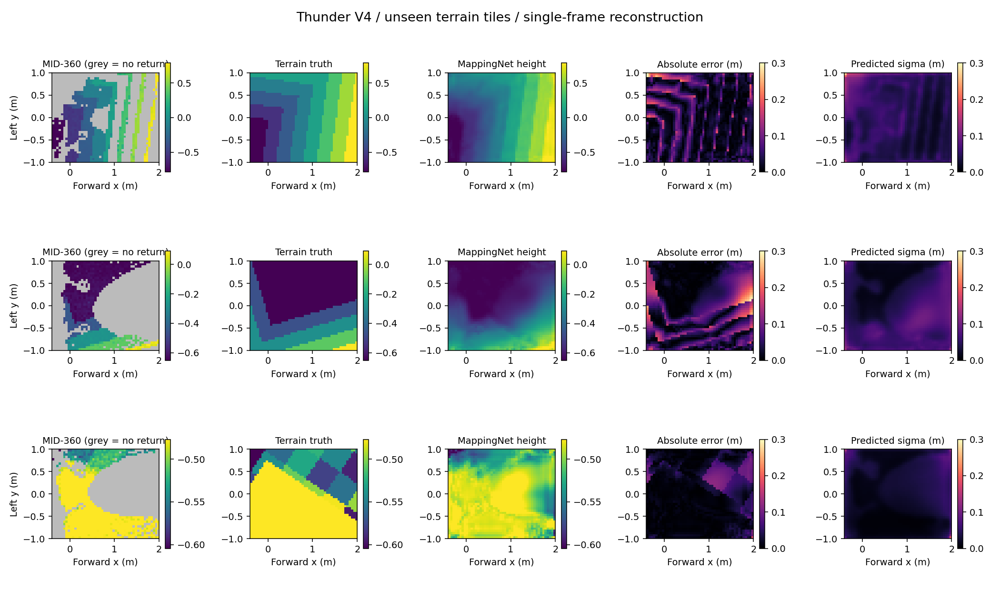

# Thunder V4 MID-360 监督建图实验

2026-09-22。先训练建图网络，再判断地图能否成为策略的可靠输入。本实验不启动 PPO，不宣称已经得到可部署的雷达行走策略。

## 点数与时序核对

[Livox 官方规格](https://www.livoxtech.com/mid-360/specs)给出 **200,000 points/s，first return**，典型帧率 **10 Hz**。因此 100 ms 的名义点数是 20,000；50 ms 为 10,000，20 ms 为 4,000。这是组帧预算，不能等同于有效地面回波数。[官方驱动](https://github.com/Livox-SDK/livox_ros_driver2)允许配置发布频率，并明确说明每帧点数可能不同，逐点携带时间戳。实机必须从记录中的时间戳、point_num、无效点和过滤结果分别计数。

当前 Omni 文件 `mid360.npy` 是 **800,000 × 2 float32** 的方位角/仰角数组，仰角范围约 −7.212° 到 52.164°。没有逐点时间戳，也没有足够的采集元数据来证明连续扫描时序。程序顺序取 20,000 条方向，40 次后循环；按 10 Hz 使用时，**模拟序列每 4 秒重复**，这不是对实机扫描周期的测量。没有强制压成 1,024 点，也没有据此宣称完整复现真实 MID-360。

这轮采集是静态姿态下的射线快照，不是运动中的 100 ms 连续扫描。地形查询最大距离为 10 m；反射率、光斑、多径、帧内运动畸变和真实里程计误差均未建模。

## 输入、网络与数据

数据路径：Thunder V4 原安装外参 → 保存的 MID-360 方向序列 → 地形和整机视觉网格的第一命中距离 → 删除被机身挡住的远处回波 → 距离噪声/丢点 → 重力对齐坐标 → 5 cm 格网内取最高点。

输入网格为 **40 × 48**，范围前后 `[−0.4, 2.0)` m、左右 `[−1, 1)` m。无回波的值为 −2，并另存观测掩码；不能解释成 −2 m 的真实坑。所有有效点参与投影。标签由独立向下射线读取地形真值，仅用于监督和评价，不进入网络输入。

原架构使用仓库的 `MappingNet`，是 [AME-2 论文 V-B](https://arxiv.org/html/2601.08485v3#S5.SS2)所述浅层 U-Net 的非官方复现：16 通道卷积、一次池化、跳连、高度/对数方差/门控三个输出头，9,475 个参数。策略使用的是后续融合得到的 `[x, y, z, variance]`，不是把全部原始点直接交给策略网络。

损失为 β-NLL，β=0.5。论文 Eq.10 的纯 TV 权重会使完全平坦样本的损失权重为零。本实验使用 **90% TV 权重 + 10% 均匀权重**，全平地批次退化为均匀权重；这是明确的适配改动。

采集使用 Isaac Sim 5.0 / Isaac Lab 2.2.1、Thunder V4 全身视觉网格，排除发射器自己的外壳，保留身体、腿和其他传感器遮挡。静态默认关节姿态，随机平移、偏航、±8° 左右俯仰/侧倾，局部地面以上 0.40–0.65 m。地形包括斜坡、粗糙面、上/下台阶和离散障碍。

80 个 8 × 8 m 地形块按列分层拆分：50 个训练、10 个验证、20 个测试，无块共享。局部目标格网始终在其地形块内。采集 **2,048 / 512 / 512 帧**，不是将同一台阶的前几帧用于训练、后几帧当独立地形验证。

在距离上加入高斯噪声 σ=0.02 m，并随机丢弃 5% 回波。这是可复现的增强参数，**不是根据官方 10 m 测距指标拟合出的全距离误差模型**。保留同一样本无噪声输入作额外诊断。

两种网络各训练 6,000 次更新、batch 64、相同随机种子和相同划分；这只是重复采样上述数据的有界试验，不等于数百万独立地形观测。按验证集整体 MAE 选择检查点，测试集不参与选权重。

## 原架构结果与失败定位

完整数据：[原架构结果 JSON](mid360_mapping_training_20260922.json)。单位为厘米，误差为高度 MAE；“边缘”指真值相邻高度差超过 5 cm 的边缘邻格，不是水平边缘定位误差。

| 测试区域 | 旧 300 步夹具权重 | 本次原架构 | 最近邻补洞基线 |
| --- | ---: | ---: | ---: |
| 全部格子 | 11.30 | 7.84 | **3.89** |
| 有回波格子 | 7.84 | **1.91** | 2.21 |
| 无回波格子 | 13.64 | 11.84 | **5.02** |
| 台阶边缘邻格 | 16.35 | 9.92 | **8.05** |
| 前方中央带 | 12.85 | 17.25 | **6.75** |

前方中央带定义为 x≥0.5 m、|y|≤0.2 m。该区域仅 **2.39%** 的格子有当帧观测；全图约 **40.30%**。新网络的全图均值改善，但前方中央带比旧权重更差；不能只报告平均值改善。最近邻基线只读取观测高度，不读取真值；它也不能提供有标定依据的置信度或保证盲区正确。

原架构有回波/未知区域的平均预测 σ 为 **3.35 / 18.27 cm**；误差落在 1σ / 2σ 内的比例为 **83.68% / 97.54%**。误差随预测不确定性分组增大，但这不等于完成概率校准。无噪声输入上，原始已观测高度 MAE 为 0.52 cm，网络已观测 MAE 却为 2.46 cm，说明网络仍会改坏干净观测。

在本次静态测试中，每个 20,000 方向样本的均值：非机身环境回波 **10,161**，增强后落入局部格网的点 **5,854**，有回波格子 **774 / 1,920**。这不是实机统计，与先前短时运动任务的点数不可直接混为一组。



## 针对性结构对照

`LidarContextMappingNet` 增加一次池化尺度和显式观测掩码通道，继续使用 U-Net 跳连、门控残差和 β-NLL。它是我们的 LiDAR 对照变体，不是论文原架构。原浅层网络的一些查询只覆盖约 0.65 m 的输入窗口，遇到整块空白时无法利用更远的观测；新结构的测试证明前方查询能接收 1.2 m 外输入的梯度。

这个对照同时改变感受野和掩码输入，因此用于检验整组适配是否有效，不能分别归因于某一项。权重标记 `model_kind=lidar-context`，现有 PPO 入口仍使用原 MappingNet，不会自动装载它。

结构对照共 **32,755** 个参数，在同一 GPU 7、同一数据集训练 6,000 次更新；最佳验证检查点为第 6,000 步。原架构最佳检查点为第 5,000 步。完整数据：[结构对照 JSON](mid360_mapping_context_20260922.json)。以下仍为高度 MAE，单位厘米：

| 测试区域 | 原架构 | 最近邻基线 | 扩大感受范围 + 掩码 |
| --- | ---: | ---: | ---: |
| 全部格子 | 7.84 | 3.89 | **3.02** |
| 有回波格子 | 1.91 | 2.21 | **1.51** |
| 无回波格子 | 11.84 | 5.02 | **4.04** |
| 边缘邻格 | 9.92 | 8.05 | **6.03** |
| 前方中央带 | 17.25 | 6.75 | **4.21** |

对照支持扩大空间上下文的方向，但**仍然会把台阶边缘平滑成斜坡**。以相邻格高度差超过 5 cm 检出边缘、允许一格邻域匹配，原架构边缘 precision/recall 为 41.82%/47.55%，新结构为 **79.62%/21.43%**。误检减少，但漏检更多，不能把全图 MAE 下降当作台阶边缘已经恢复准确。

含训练噪声的测试集上，新结构 1σ/2σ 覆盖为 **79.14%/95.49%**；四组不确定性分位的预测 σ 与实际 RMSE 接近。切换到同场景的干净回波后，2σ 覆盖却降至 **84.57%**，原始已观测误差 0.52 cm 经网络变成 2.52 cm。这暴露了对噪声分布的依赖，尚不能声称已完成实机方差标定。后续需要混合噪声训练、干净观测保真和边缘恢复的独立评价；两组对照都没有消除安装朝向造成的真实盲区。



## 复现与产物

在已有的 BSRL `thunder2` 环境内运行，不安装新依赖：

```bash
cd /home/bsrl/ame2-mid360-codex
export CUDA_VISIBLE_DEVICES=7
export OMP_NUM_THREADS=4
export PYTHONPATH="$PWD:/home/bsrl/omni-test-codex/LidarSensor"
python scripts/collect_thunder_mapping.py --headless --device cuda:0 --num-envs 16
python scripts/train_mid360_mapping.py --device cuda:0 --steps 6000 \
  --baseline-checkpoint artifacts/mid360_validation/mapping_smoke.pt
python scripts/train_mid360_mapping.py --device cuda:0 --steps 6000 \
  --model lidar-context --output artifacts/mapping_training/context
python -m pytest scripts/test_mid360_training.py -q
```

数据位于 `artifacts/mapping_training/dataset.pt`，原架构权重位于 `artifacts/mapping_training/run/mapping_best.pt`；结构对照权重位于 `artifacts/mapping_training/context/mapping_best.pt`。产物目录不进入 Git；源代码、指标和预览图纳入仓库。

训练检查有限损失和梯度、验证集选权重、保存恢复一致性。四项针对性测试覆盖平地梯度、已观测/未知指标、无真值的最近邻基线、扩大后的感受野。采集检查地形块隔离、传感器位姿、两路 pattern 同步和有效地图回波。

实际执行中，完整采集、原架构训练、结构对照训练均退出 **0**；两份最佳权重均通过重新加载推理一致性验证。四项针对性测试通过。GPU 7 运行结束后为 14 MiB、0% 利用率；未操作其他 GPU 作业。

这里评估的是**历史融合之前的单帧重建**。后续仍须分别验证位姿对齐的历史地图、真实时间戳/去畸变、外参和光学轴、实机噪声与未见场景，然后再将满足误差要求的地图交给强化学习策略。
