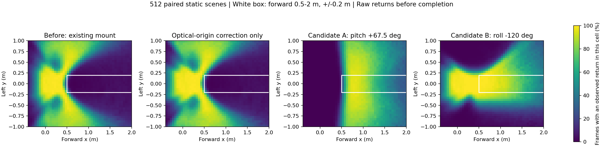
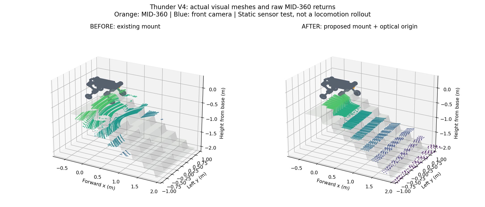
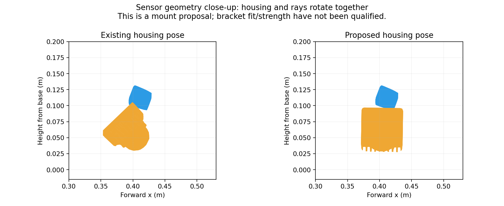
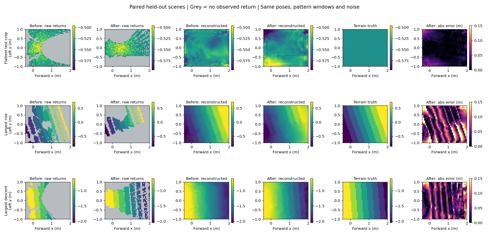

# Thunder V4 MID-360：原点修正与安装姿态对照

2026-09-22。这里修正测量原点，并用实际 URDF 外壳和同一组扫描方向验证两个物理安装候选。所有结果均来自 Isaac Sim 5.0 / Isaac Lab 2.2.1 的静态采集；尚未验证实机安装、打印支架强度或行走能力。

## 软件修正与物理改装

MID-360 的官方视场是水平 360°、垂直 −7°～52°，不是只有一圈扫描线。200,000 first-return points/s、典型 10 Hz 对应名义 20,000 条方向/100 ms，不等于 20,000 个有效地面回波。[Livox 规格](https://www.livoxtech.com/mid-360/specs)、[厂家资料下载](https://www.livoxtech.com/mid-360/downloads)。本轮没有增加点数、扩大视场或用地形真值填充网络输入。

将 Thunder 的 `lidar1_Link.STL` 与厂家 STEP 转换得到的光学坐标网格对齐，24 个轴向初始化的截尾 ICP 最佳残差为 0.168 mm。厂家显示网格量化为 0.25 mm，因此这只是 CAD 几何对齐残差，不能当作雷达测量精度。结果支持两者 +Z 同向，**没有支持上下颠倒的坐标轴修正**；光学原点位于模型 link 原点的局部 +Z 约 7.5 mm。外壳有近似偏航对称性，不能据此声称完成全部实机轴向标定。[对齐结果](mid360_cad_alignment_20260922.json)。

| 配置 | 修改 | 含义 |
| --- | --- | --- |
| `thunder_v4_mid360_legacy.json` | 保留旧位姿 | 历史对照 |
| `thunder_v4_mid360.json` | 测量原点增加局部 +Z 7.5 mm | CAD 名义软件修正，安装方向不变 |
| `thunder_v4_mid360_ground_view.json` | roll=0°、pitch=+67.5° | 候选 A，物理安装变化 |
| `thunder_v4_mid360_side_view.json` | roll=−120°、pitch=0° | 候选 B，物理安装变化 |

旧姿态 roll=−180°、pitch=−45° 将测量 +Z 指向前下方。+Z 是顶部未扫描锥体的中心，并不是一束激光。因此外壳朝下不保证前方中央地面落在实际扫描范围内。候选 A 将该盲区转到前上方；发现它严重损失近身观测后，增加候选 B，将顶部盲区转向侧下方，让前方与部分近身地面进入视场。

两种候选都保留原 CAD 安装 link 的位置，**外壳与射线一起旋转**，并按旋转后的局部 +Z 计算光学原点。`prepare_mount_urdf` 只在实验输出目录生成私有 URDF，改动现有固定 `lidar1_joint`；原始机器人资产、LingTu 实机 RobotConfig 均未改写。机身、腿、相机和后雷达继续参与遮挡。发射雷达自己的外壳与前序实验一致，从自身遮挡查询中排除。

这两个候选是观测几何实验，尚未完成支架设计、机械干涉、相机自身视野和线缆空间验证。不能将新配置直接写进仍使用旧安装的实机。

## 配对采集与训练

- 80 个地形块：训练/验证/测试分别 50/10/20 块，不共享地形块；每组采集 2,048/512/512 帧。
- 相同机器人位姿、默认关节姿态、地形块、20,000 条 pattern 方向窗口和按帧生成的噪声。随机基座高度为当地地面上 0.40–0.65 m。
- 同格取最大高度，网格为 40×48、5 cm；x∈[−0.4,2)、y∈[−1,1)。空格保留观测掩码。
- 距离噪声 σ=0.02 m、5% 随机丢点是训练增强，不是实机拟合误差模型。保存的 800,000 条角度没有逐点时间戳，40 个窗口后循环；未建模帧内运动畸变。
- 原安装、候选 A、候选 B 各训练相同 `LidarContextMappingNet` 6,000 步、batch 64、seed 922。它是带观测掩码、两级池化的 U-Net 适配变体，共 32,755 个参数。原安装和 A 的最佳验证检查点为第 6,000 步，B 为第 5,500 步。
- 地形真值只参与监督和评价；网络输入只有扫描生成的稀疏高度图和观测掩码。本轮评价位于历史融合之前。

保存的位姿、扫描窗口和地形块逐项完全相同，最终使用同一份真值标签。候选 A 首次采集的严格检查发现 5,898,240 个格子标签中有 1 个在台阶边界因射线数值舍入差异偏移 4.95 cm。采集器仅允许数量不超过每批 0.1%、且新值能匹配原真值 3×3 邻域的边界差异，再使用基准标签；其他差异仍报错。此次 A 共记录 1 格，B 为 0 格。这不是用真值修补雷达输入。

候选 B 是看到 A 的覆盖损失后追加的设计实验，因此这些测试块虽然未参与网络训练，也已用于安装方案探索；**还需要另一组未用于设计决策的场景做最终验收**。

## 效果与代价

前方中央带定义为 x∈[0.5,2)、|y|≤0.2 m；“近身”定义为 x∈[−0.4,0.5)、|y|<1 m，不等同于经过规划的落脚点。覆盖率表示单帧中格子有实际射线回波的比例，计算在增强和投影之后、网络补全之前。

| 指标 | 旧配置 | 只修原点 | 候选 A | 候选 B |
| --- | ---: | ---: | ---: | ---: |
| 前方中央带覆盖率 | 3.21% | 3.40% | 63.55% | 79.38% |
| 全图覆盖率 | 39.45% | 41.77% | 41.33% | 41.70% |
| 近身覆盖率 | 61.37% | 66.85% | 1.70% | 34.56% |
| 前方重建高度 MAE | 5.97 cm | 未训练 | 2.81 cm | 2.32 cm |
| 全图重建高度 MAE | 4.21 cm | 未训练 | 3.73 cm | 3.58 cm |
| 未观测格子高度 MAE | 5.72 cm | 未训练 | 5.00 cm | 4.77 cm |
| 边缘邻格高度 MAE | 8.61 cm | 未训练 | 7.79 cm | 7.78 cm |
| 边缘召回率（允许一格匹配） | 39.93% | 未训练 | 49.33% | 46.69% |

原点修正能影响近距离遮挡判断，但基本没有解决前方中央盲区。A 的前方观测改善明显，却几乎失去整个近身区域，因此不作为定版安装建议。B 保留了更多近身观测并进一步改善前方结果，但近身覆盖仍低于旧姿态，侧向覆盖也不均匀；它是继续验证的候选，尚不是最优或定版方案。



下面使用 Isaac 中实际导出的完整机器人视觉网格与原始环境回波。橙色为 MID-360，蓝色为前相机。左为旧安装、右为候选 B；姿态来自静态测试，机器人没有在执行行走。





以下依次展示旧原始观测、新原始观测、旧网络重建、新网络重建、地形真值、新网络误差。灰色是无当帧观测。按地形自身统计选择最平坦、上升最大、下降最大的样本，不按改善幅度挑图。



仍存在明确问题：台阶边缘被平滑，边缘漏检较多；平均误差下降并不意味着落脚边缘已可靠。未观测区域的补全仍需历史信息，且不能把网络预测写成真实观测。B 的误差在预测 2σ 内的比例为 93.31%，切换到干净回波降至 88.79%；干净回波原始已观测格高度 MAE 为 0.71 cm，而全图重建 MAE 为 4.26 cm。实机噪声分布和不确定性均未完成标定。

完整指标：[配对结果](mid360_mount_comparison_20260922.json)、[旧安装训练](mid360_mount_legacy_training_20260922.json)、[候选 A 训练](mid360_mount_ground_training_20260922.json)、[候选 B 训练](mid360_mount_side_training_20260922.json)。这些是新的配对样本，不与上一轮独立采样的 3.02 cm 全图误差直接比较。

## 复现与产物

在已配置 robot_lab 和配套 OmniPerception 修复的 `thunder2` 环境中运行，不新增依赖：

```bash
cd /home/bsrl/ame2-mid360-codex
export CUDA_VISIBLE_DEVICES=7
export OMP_NUM_THREADS=4
export PYTHONPATH="$PWD:/home/bsrl/omni-test-codex/LidarSensor"
python scripts/collect_thunder_mapping.py --headless --device cuda:0 --preview \
  --config configs/thunder_v4_mid360_legacy.json \
  --output artifacts/mount_comparison/legacy/dataset.pt
for name in origin ground side; do
  case "$name" in
    origin) config=configs/thunder_v4_mid360.json ;;
    ground) config=configs/thunder_v4_mid360_ground_view.json ;;
    side) config=configs/thunder_v4_mid360_side_view.json ;;
  esac
  python scripts/collect_thunder_mapping.py --headless --device cuda:0 --preview \
    --config "$config" --output "artifacts/mount_comparison/$name/dataset.pt" \
    --pose-reference artifacts/mount_comparison/legacy/dataset.pt
done
for name in legacy ground side; do
  python scripts/train_mid360_mapping.py --device cuda:0 --steps 6000 --model lidar-context \
    --dataset "artifacts/mount_comparison/$name/dataset.pt" \
    --output "artifacts/mount_comparison/$name/run"
done
python scripts/compare_mid360_mounts.py --proposal side
python -m pytest scripts/test_mid360_mount.py scripts/test_mid360_training.py -q
```

服务器目录 `artifacts/mount_comparison/<配置>/` 保存数据和私有机器人资产；`run/mapping_best.pt` 保存验证集选出的权重。三份权重也已取回本地同一路径。数据与权重不进入 Git，指标、配置、脚本和展示图进入仓库。当前 PPO 入口仍使用原 `MappingNet`，不会自动接受这些 context 变体权重。

四组完整采集、三组训练和最终比较均退出 0，检查点重新加载推理通过。针对性测试 6 项通过，覆盖两组候选的光学原点/外壳变换一致、私有 URDF、共享资产不被修改，以及已有建图训练性质。首次候选 A 的标签断言失败后关闭阻塞，只停止了本任务核实过的采集进程；修正后重新采集正常退出。GPU 7 最后为 14 MiB、0% 利用率，未操作其他 GPU 作业。

下一阶段应联合验证安装位置、左右地面覆盖与机身遮挡，再用运动轨迹检验历史地图在脚下的保持能力；随后处理边缘保真和不确定性校准。当前结果支持继续做输入与建图验证，尚不足以宣称雷达强化学习行走方案完成。
