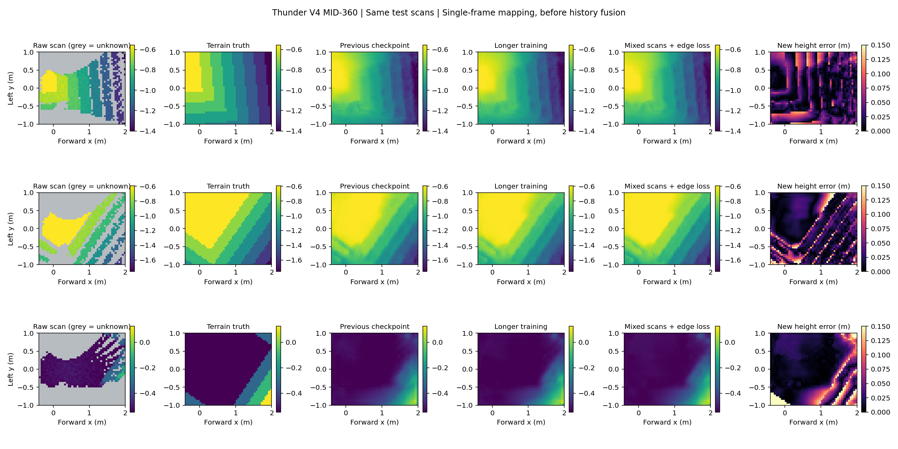

# MID-360 建图第二轮训练

2026-09-22。沿用 Thunder V4 侧倾安装候选，扩充静态扫描样本并继续监督训练。两组各完成 12,000 次更新，均从上一轮第 5,500 步选出的 `LidarContextMappingNet` 开始。此轮训练的是高度与不确定性网络，不是 PPO 行走策略。

## 数据和训练方法

采集范围、安装位姿、20,000 条方向、5 cm 格网、距离噪声 σ=0.02 m 与 5% 丢点沿用[安装对照](mid360_mount_comparison.md)。训练/验证/测试样本增至 **8,192 / 1,024 / 1,024 帧**，地形仍是原来的 **50 / 10 / 20 块**。启动前比较了新旧数据的 `tile_splits` 和完整传感器配置，均相同，因此没有将预训练所用的训练块调入测试集。更多采样位姿不等于更多独立地形；这些测试块也已用于安装方案探索，不能当作全新设计验收集。

两组都只载入初始模型权重，重新开始 Adam 与余弦学习率调度：初始学习率 0.0003，最低 0.00003，batch 64，seed 922。模型保持 32,755 个参数。每组 12,000 步是对 8,192 帧重复抽样 768,000 次，并非采集了这么多独立雷达帧。

| 方法 | 回波输入 | 训练损失 |
| --- | --- | --- |
| `control` | 原有带噪声/丢点扫描 | 原 β-NLL 与地形样本权重 |
| `edge_mix` | 每帧 50% 概率使用干净射线回波，50% 使用带噪回波 | 原损失 + 权重 1.0 的相邻格高度差损失 |

干净回波来自同一仿真射线查询，仍有几何盲区和机身遮挡，不是地形真值。每次选择整帧输入及其对应掩码；不把干净值与带噪掩码混配。增强选择使用独立随机生成器，避免改变两组训练的样本索引序列。地形真值只用于监督与评估。

新增损失在 x、y 两个方向计算**带符号的相邻高度差**，使用 beta=0.02 m 的 Smooth L1；真值差超过 5 cm 的相邻格对权重为 5，其余为 1，各帧归一化后取平均。它惩罚阶跃被平滑，也惩罚平地出现错误阶跃。该项与混合噪声同时改变，因此这轮只能判断整组训练方法的效果，不能分别归因。

两组共用同一验证选模规则：带噪/干净输入的全图 MAE 和边缘邻格 MAE 四项等权平均。训练前的初始权重也纳入候选，防止微调退化后仍被强制替换。两组最终均选择微调第 **10,000 步** 的权重；不是直接选择最后一帧或根据测试集挑选。

## 同一批测试扫描上的结果

初始模型重新在这次 1,024 帧测试集上评估，因此以下可直接横向比较；不要与上一轮 512 帧的数值混用。误差单位均为 cm，边缘误差是边缘邻格的高度误差，不是水平边缘定位误差。

| 带噪输入 | 原权重 | 继续原方法 | 混合回波 + 高度差约束 |
| --- | ---: | ---: | ---: |
| 全图高度 MAE | 3.47 | **3.13** | 3.23 |
| 有回波格高度 MAE | 1.88 | **1.65** | 1.87 |
| 未观测格高度 MAE | 4.64 | **4.22** | 4.24 |
| 边缘邻格高度 MAE | 7.66 | 7.31 | **7.25** |
| 前方中央带高度 MAE | 2.18 | **1.93** | 2.13 |
| 边缘召回率（允许一格） | 45.12% | 46.29% | 46.52% |
| 预测 2σ 覆盖率 | 93.63% | 94.58% | 94.10% |

| 干净回波输入 | 原权重 | 继续原方法 | 混合回波 + 高度差约束 |
| --- | ---: | ---: | ---: |
| 全图高度 MAE | 4.05 | 3.76 | **3.24** |
| 有回波格高度 MAE | 2.64 | 2.54 | **1.88** |
| 未观测格高度 MAE | 5.09 | 4.66 | **4.25** |
| 边缘邻格高度 MAE | 7.91 | 7.52 | **7.14** |
| 前方中央带高度 MAE | 3.12 | 2.90 | **2.11** |
| 预测 2σ 覆盖率 | 89.14% | 85.45% | **95.54%** |

主要收益是减轻对单一噪声分布的依赖。原方法继续训练在带噪数据上最好，却仍会在干净回波上产生较大误差和过度自信。混合训练改善了这部分问题，但在带噪整体误差上略输给对照组；不能宣称新损失全面更好。

台阶边缘收益有限：召回仍不到 50%，新增损失没有解决缺少几何观测时的边缘补全。两份权重都保留为研究对照，未替换实机或 PPO 的地图模型。2σ 覆盖接近 95% 也只适用于本实验输入分布，不代表实机不确定性已经校准。



图中按地形边缘数量排序，固定选取第 0、1/3、2/3 分位样本，没有按网络改善程度选图。灰色为无当前帧观测。[完整数值与训练摘要](mid360_refinement_20260922.json)。CPU 离线复评与 GPU 训练末尾评估有微小浮点差异，表格使用离线统一评估值。

## 运行和验证

服务器工作目录 `/home/bsrl/ame2-mid360-codex`，Python 为 `/home/bsrl/miniconda3/envs/thunder2/bin/python`。使用 GPU 7，无新依赖，未停止其他作业。

```bash
export CUDA_VISIBLE_DEVICES=7 OMP_NUM_THREADS=4
export PYTHONPATH="$PWD:/home/bsrl/omni-test-codex/LidarSensor"
python scripts/collect_thunder_mapping.py --headless --device cuda:0 \
  --num-envs 16 --seed 922 --train-batches 512 --eval-batches 64 \
  --config configs/thunder_v4_mid360_side_view.json \
  --output artifacts/mapping_round2/dataset.pt
python - <<'PY'
import torch
old = torch.load('artifacts/mount_comparison/side/dataset.pt', weights_only=True)
new = torch.load('artifacts/mapping_round2/dataset.pt', weights_only=True)
assert old['complete'] and new['complete']
assert old['tile_splits'] == new['tile_splits']
assert old['config'] == new['config']
PY
for recipe in control edge_mix; do
  extra=()
  if [ "$recipe" = edge_mix ]; then extra=(--clean-fraction 0.5 --edge-loss-weight 1.0); fi
  python scripts/train_mid360_mapping.py --model lidar-context --device cuda:0 \
    --dataset artifacts/mapping_round2/dataset.pt \
    --init-checkpoint artifacts/mount_comparison/side/run/mapping_best.pt \
    --output "artifacts/mapping_round2/$recipe" --steps 12000 --seed 922 \
    --lr 0.0003 --min-lr 0.00003 --validation-objective balanced "${extra[@]}"
done
python scripts/compare_mid360_refinement.py
python -m pytest scripts/test_mid360_training.py scripts/test_mid360_mount.py -q
```

采集、划分检查、两组训练、统一评价全部退出 **0**；有限损失/梯度和权重重新加载验证通过。9 项针对性测试通过，包括高度差损失对阶跃/斜坡/伪边缘的区分、整帧观测掩码一致、拒绝加载不同安装姿态的权重。两组训练循环耗时约 84 s、100 s，不包含数据采集和离线复评。结束后 GPU 7 为 14 MiB、0% 利用率。

数据在服务器 `artifacts/mapping_round2/dataset.pt`。两份最佳权重和完整训练曲线位于 `artifacts/mapping_round2/{control,edge_mix}/{mapping_best.pt,result.json}`，已取回本地同一路径；未提交权重或大数据到 Git。配置、实现、指标和预览图进入仓库。

下一步应优先验证运动中的位姿对齐历史地图，覆盖雷达看过后进入脚下的区域，并对已观测/历史观测/网络补全分别评价边缘。当前实验尚无真实点云、帧内去畸变或行走策略收敛证据。
